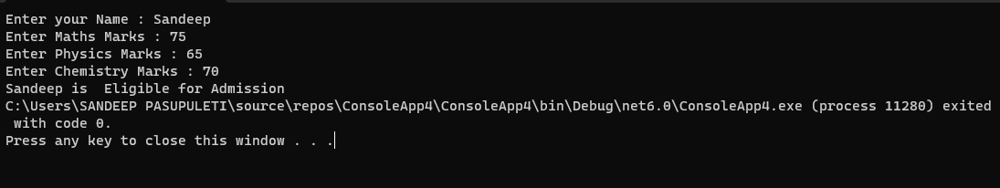
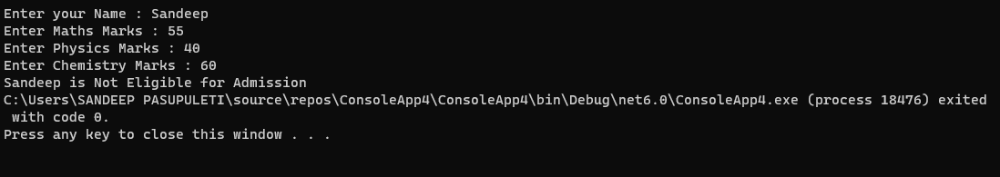

# Eligibility-for-Admission

## Aim:
To write C# program to find the eligibility for admission to an engineering course

## Algorithnm:

### Step-1:
Create a new Class.
### Step-2:
Create variable of respective data types to store marks.
### Step-3:
Calculate the total for all the three subjects and store it.
### Step-4:
Calculate the total for two subjects and store it.
### Step-5:
Marks in maths >= 65 & Marks in physics >=55 & Marks in chemistry >=50 Total marks in all three subjects >= 180 or total in maths and physics >= 140
### Step-6:
Using Nested if check whether the person is eligible or not for admission based on given conditions.
### Step-7:
End the Program.

## Program:
```
Name : P.SANDEEP
REG.NO : 212221230074
DEPT : AI-DS
```
```
using System;
namespace breakstatement
{
    class Program
    {
        static void Main(string[] args)
        {
            string name;
            int m, p, c;
            Console.Write("Enter your Name : ");
            name = Console.ReadLine();
            Console.Write("Enter Maths Marks : ");
            m = Convert.ToInt32(Console.ReadLine());
            Console.Write("Enter Physics Marks : ");
            p = Convert.ToInt32(Console.ReadLine());
            Console.Write("Enter Chemistry Marks : ");
            c = Convert.ToInt32(Console.ReadLine());

            if (m >= 65 && p >= 55 && c >= 50)
            {
                if ((m + p + c >= 180) || (m + p >= 140))
                {
                    Console.Write(name + " is  Eligible for Admission",name);
                }
                else
                {
                    Console.Write(name + " is Not Eligible for Admission",name);
                }
            }
            else
            {
                Console.Write(name + " is Not Eligible for Admission");
            }
        }
    }
}
```
## Output:

### OUTPUT-1:

### OUTPUT-2:


## Result:
Thus to write C# program to find the eligibility for admission to an engineering course is successfully executed.